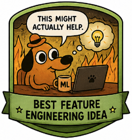

# Group Project: Can AI Help You Build a Better Machine Learning Model?

**Course:** ICT 3.3 Machine Learning and Data Mining  
**Level:** Bachelor  
**Date:** May 2026  

## Project Overview

In this group project, you will build a small machine learning pipeline and critically test whether an AI assistant can improve one part of your work.

The AI assistant may help you think, compare, or debug, but it must **not replace your own modelling decisions**.

---

## Core Requirements

Your project must include:

1. Choose one dataset and understand its variables.
2. Define one clear machine learning problem.
3. Build at least one baseline ML model.
4. Evaluate the model using appropriate metrics.
5. Perform error analysis: what does the model get wrong and why?
6. Add one light, controlled LLM component and critically evaluate whether it helped.

---

## Suggested Project Tracks

### Track A — Predict Something Useful

Regression or classification tasks, for example:

- predict exam scores
- predict house prices
- predict bike rentals
- predict customer churn
- predict health risk

### Track B — Classify Text or Behaviour

Classification tasks, for example:

- classify reviews
- detect spam messages
- classify news headlines
- classify user behaviour

### Track C — Discover Hidden Groups

Use clustering to identify groups of:

- songs
- customers
- countries
- penguins
- documents

### Track D — AI vs Classical ML

Compare a traditional ML model with an LLM prompt on the same task.

Analyze:

- accuracy
- behaviour
- strengths and weaknesses
- where the LLM helps or fails

---

## Dataset Menu

You may choose your own dataset, but the following options are beginner-friendly and suitable for bachelor-level ML projects.

Some Kaggle datasets may require a free Kaggle account.

## Dataset Menu

| Theme | Dataset | Link | Possible task | Good for |
|---|---|---|---|---|
| Education | UCI Student Performance | [Open dataset](https://archive.ics.uci.edu/dataset/320/student%2Bperformance) | Predict final grade; classify pass/fail; analyze important factors | Regression, classification, feature engineering |
| Urban mobility | UCI Bike Sharing | [Open dataset](https://archive.ics.uci.edu/ml/datasets/bike%2Bsharing%2Bdataset) | Predict number of bike rentals from weather, season, and time | Regression, error analysis, time features |
| Music | Spotify Tracks Attributes and Popularity | [Open dataset](https://www.kaggle.com/datasets/melissamonfared/spotify-tracks-attributes-and-popularity) | Predict popularity; cluster songs by audio features | Regression, classification, clustering |
| Health | UCI Heart Disease | [Open dataset](https://archive.ics.uci.edu/dataset/45/heart%2Bdisease) | Predict heart disease presence from clinical features | Binary classification, interpretability |
| Text / NLP | UCI SMS Spam Collection | [Open dataset](https://archive.ics.uci.edu/dataset/228/sms%2Bspam%2Bcollection) | Classify SMS messages as spam or ham | Text classification, prompt vs ML comparison |
| Movies | IMDb 50K Movie Reviews | [Open dataset](https://www.kaggle.com/datasets/lakshmi25npathi/imdb-dataset-of-50k-movie-reviews) | Classify reviews as positive or negative | NLP, sentiment analysis, LLM comparison |
| Biology / animals | Palmer Penguins | [Open dataset](https://github.com/allisonhorst/palmerpenguins) | Predict penguin species; cluster penguins by measurements | Classification, visualization, clustering |
| Food / chemistry | UCI Wine Quality | [Open dataset](https://archive.ics.uci.edu/ml/datasets/wine%2Bquality) | Predict wine quality from chemical properties | Regression, classification, feature scaling |
---

## Controlled LLM Component

Choose **one** of the following options.

### Option 1 — Problem Formulation Assistant

Ask an LLM what ML problems could be solved with your dataset.

Then:

- compare the LLM suggestion with your own idea
- justify your final task
- identify whether it is classification, regression, clustering, or another method

### Option 2 — Feature Engineering Helper

Ask an LLM to suggest useful features.

Then:

- implement exactly one suggestion
- test whether the model improves compared with the baseline
- explain why the suggestion helped or did not help

### Option 3 — Error Analysis Assistant

Show the LLM a few model mistakes.

Ask why the mistakes might happen.

Then relate the explanation to ML concepts such as:

- overfitting
- underfitting
- data quality
- class imbalance
- missing features

### Option 4 — Prompt vs Model Comparison

Compare a classical ML model with an LLM prompt on the same examples.

Report:

- accuracy
- qualitative behaviour
- whether the LLM is sensitive to prompt wording

---

## Minimum Experiment Structure

Your experiment must include:

### 1. Baseline

Train a simple model using the original features.

### 2. Improved Version

Change one thing, such as:

- one feature
- one model
- one preprocessing step
- one LLM-assisted idea

### 3. Evaluation

Compare baseline vs improved version using the same train/test split.

### 4. Interpretation

Explain:

- what changed
- why the result improved
- or why the result did not improve

---

## Required Error Analysis

Choose **three interesting mistakes** made by your model.

For each mistake, answer:

1. What was the input example?
2. What was the true label or value?
3. What did the model predict?
4. Why might the model have failed?
5. Would a human have made the same mistake?
6. What would you try next to improve the model?

---

## Final Presentation Format

Each group gives a **5-minute presentation**.

| Slide | Content |
|---|---|
| 1 | Problem and dataset |
| 2 | ML approach and baseline |
| 3 | Best result and metric |
| 4 | Most interesting error |
| 5 | Did the AI assistant help or mislead you? |

---

## Assessment Suggestion

| Criterion | Weight | What matters |
|---|---:|---|
| Problem formulation | 15% | Clear task, dataset understanding, appropriate ML framing |
| ML implementation | 25% | Correct preprocessing, baseline, modelling, and reproducibility |
| Evaluation | 20% | Appropriate metrics, fair comparison, clear interpretation |
| Error analysis | 20% | Concrete mistakes, thoughtful explanations, links to ML concepts |
| Critical LLM use | 15% | Controlled use, comparison with own reasoning, honest limits |
| Presentation clarity | 5% | Clear story, readable visuals, concise delivery |

---

## Bonus Badges

Groups may receive bonus recognition for:

| Badge                                                          | Meaning |
|----------------------------------------------------------------|---|
|        | Best error analysis |
|  | Best feature engineering idea |
|     | Best critical use of an LLM |
|        | Best visualization |
|   | Best real-world problem formulation |
|           | Best tech smart |
---

## Reminder

A strong project is **not** the one with the highest accuracy.

A strong project is one where you:

- understand the data
- make reasonable choices
- test them fairly
- explain what the model still does not understand
